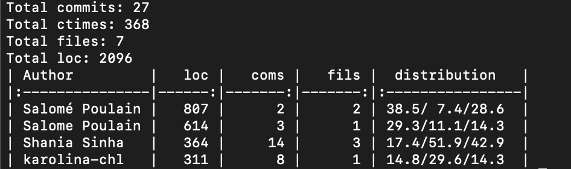

# Assignment 1: Computing the Area of the Mandelbrot Set

This repository contains the materials and code for **Assignment 1**, which focuses on exploring properties of the Mandelbrot set using Monte Carlo methods. The goal is to estimate the area of the Mandelbrot set (\(A_M\)) and study its convergence behavior under different sampling techniques.

---

## Contents

### Files
1. **`Assignment 1 - MANDELBROT.pdf`**: The assignment description outlining the objectives, tasks, and theoretical background for computing the area of the Mandelbrot set.
2. **`code.ipynb`**: A Jupyter Notebook that implements the methods described in the assignment and provides results, visualizations, and analysis.

---

## Objectives
1. **Understand the Mandelbrot Set**:
   - Explore the fractal structure of the Mandelbrot set and its properties.
   - Implement iterations to compute whether points belong to the set.

2. **Estimate the Area (\(A_M\))**:
   - Use Monte Carlo integration to estimate the area of the Mandelbrot set (\(A_M\)).
   - Calculate estimates (\(A_{i,s}\)) as functions of the number of iterations (\(i\)) and the sample size (\(s\)).

3. **Analyze Convergence**:
   - Investigate how \(A_{i,s}\) converges to \(A_M\) as \(i \to \infty\) and \(s \to \infty\).
   <!-- - Ensure a balance between \(i\) and \(s\) to maintain comparable error levels. -->

4. **Compare Sampling Methods**:
   - Evaluate the accuracy and efficiency of:
     - Pure Random Sampling
     - Latin Hypercube Sampling (LHS)
     - Orthogonal-Array Latin Hypercube Sampling (OA-LHS)

5. **Improve Convergence**:
   - Formulate and test strategies to enhance the convergence rate of the Monte Carlo method.

---

## Features
- **Mandelbrot Set Visualization**:
  - Generate visualizations of the Mandelbrot set to explore its structure.
  
- **Monte Carlo Sampling**:
  - Estimate the area of the set using five sampling methods:
    - Random Sampling
    - Latin Hypercube Sampling (LHS)
    - Orthogonal-Array Latin Hypercube Sampling (OA-LHS)
    - Stratified Sampling
    - Sobol Sampling

- **Convergence Analysis**:
  - Study convergence behavior of different sampling methods.

- **Optimization**:
  - Implement methods to improve the accuracy of area estimation.

---

## Usage

### Prerequisites
- Install the required Python libraries:
  ```bash
  pip install numpy scipy matplotlib tqdm
  ```

### Running the Code
- Open the code.ipynb file in Jupyter Notebook or JupyterLab.
- Run the cells sequentially to:
    - Visualize the Mandelbrot set.
    - Estimate the area using different sampling methods.
    - Analyze convergence behavior.

---

## Work Distribution

The work was split (approximately) evenly among the three group members. For code, `git fame` screenshot included below:
